# Zaawansowane techniki bazodanowe
# Zadanie 6  
## Tomasz Jakubowski  
## nr albumu 7043  

\newpage
\clearpage

Projekt został sporządzony z wykorystaniem bazy danych SQLite oraz języka programowania Python 3 z wykorzystaniem biblioteki Flask.  
Frontent to HTML z wykorzystaniem języka templatingu Jinja2 oraz frameworka CSS Spectre.

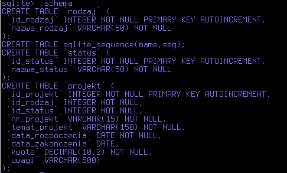  

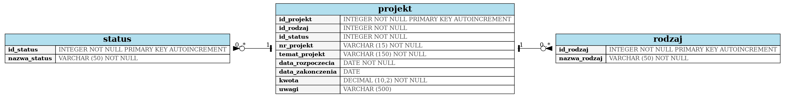  

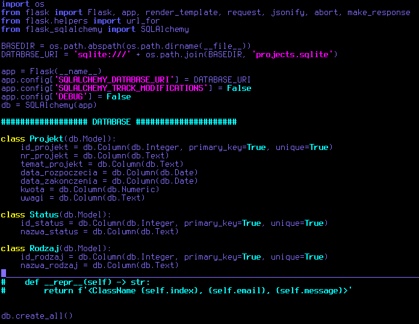  

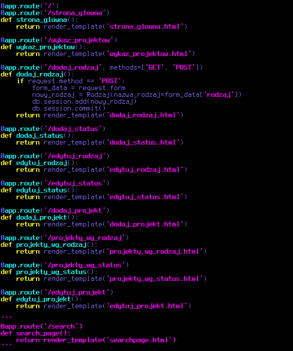  

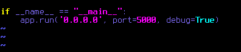  

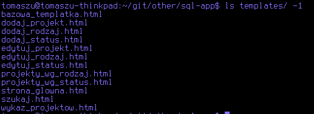  

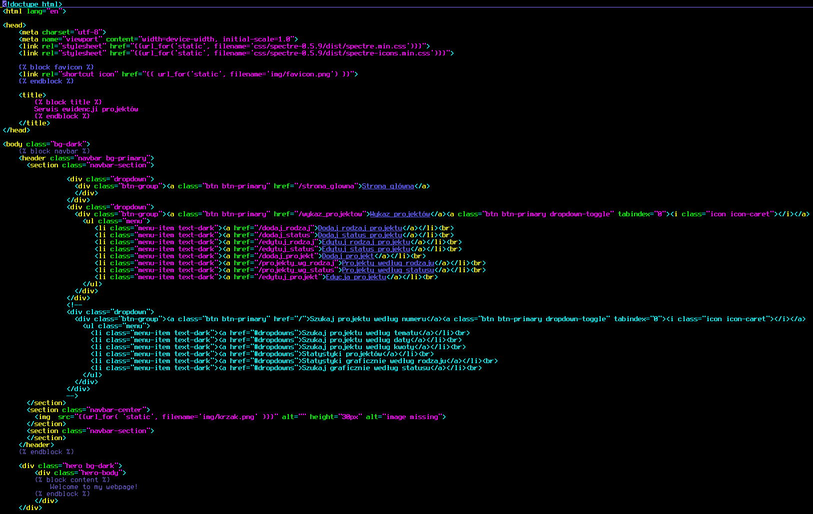  

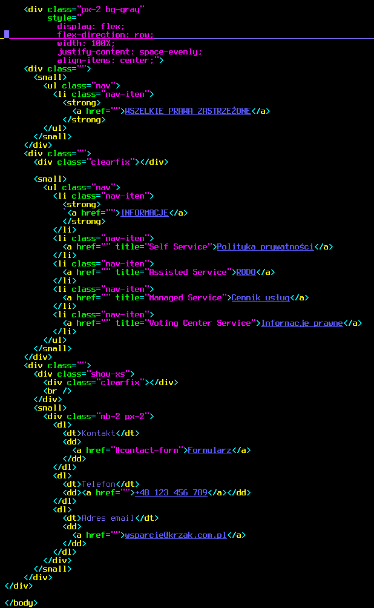  

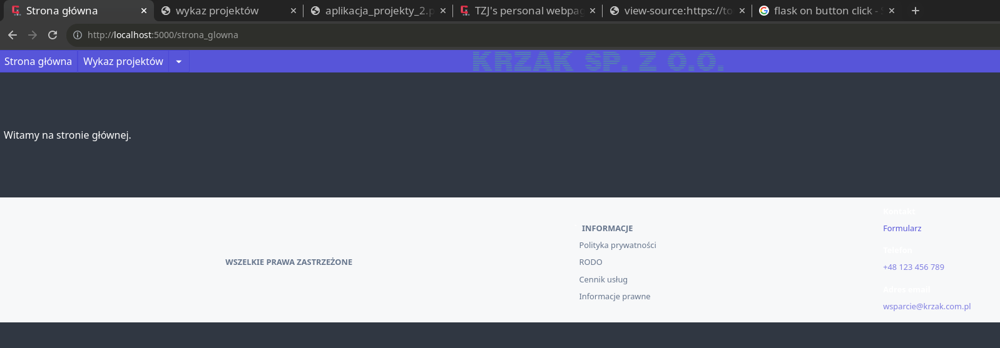  

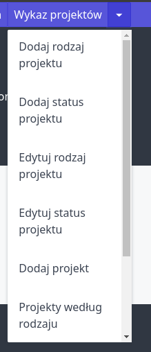  

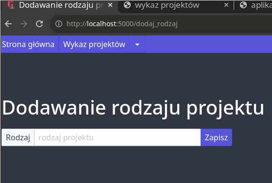  

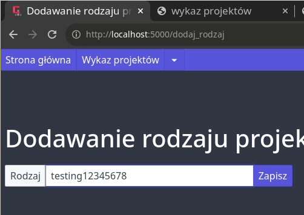  

  

